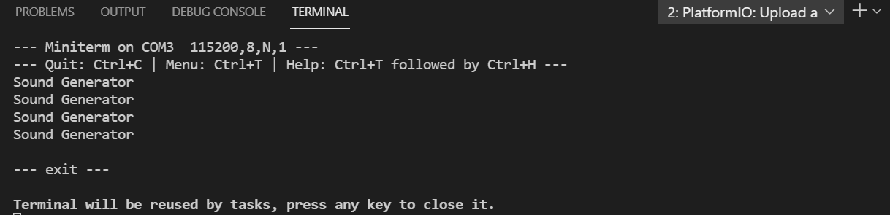

# PRACTICA 7 
### PARTE 1:
Siguiendo la programacion que se nos proporciona para realizar la practica podemos ver que la primera parte hacemos la definicion de las distintas librerias necesarias para su correcto funcionamiento seguido de la declaracion de un conjunto de 3 variables de distintos tipos los cuales son relacionados con 3 de las librerias definidas i que controlan el audio.
Seguidamente nos encontramos con el bloque del setup cuyo conjunto de comandos que hay en el empieza por como es comun en todos los programas un serial.begin a la misma velocidad del monitor_speed que se encuentra en el .ini, siguido a este encontramos las distintas asignaciones a las variables posteriormente declaradas la primera de ellas es la variable in que a traves de igualarla al comando new AudioFileSourcePROGMEM(sampleaac, sizeof(sampleaac)); importamos a esta variable el archivo de audio y el tamaño de esta, la variable acc tambien le asiganmos otro comando en este caso la igualamos al comando new AudioGeneratorAAC(); el cual tiene como finalidad descodificar el audio en .aac y la ultima asignacion que nos encontramos es a la variable out la cual se iguala al comando new AudioOutputI2S(); este es usado para asignar una ganancia de audio y los pines que tiene ese componente que usamos. Posteriormente a estas distintas asignaciones nos encontramos con la configuracion de las distintas variables que hay dentro de la variable out, es decir, a traves de comando out -> SetGain(0.125); le asignamos una ganancia de audio de 0,125 y respecto a los pines usaremos el comando out -> SetPinout(26,25,22); para asignarlos correctamente, por ultimo y finalizar el bloque del setup nos encontramos con el comando aac->begin(in, out); el cual se encarga de relacionar la entrada descrita con la salida.
Seguido al bloque setup nos encontramos el bloque del loop el cual esta formado por un if y un else, en este caso si el bucle se lleva a cabo de forma correcta se nos ejecutara el seguido de funciones que se encuentran en el if ya que esa es su condicion una vez dentro de este nos encontramos el comando aac->loop(); el cual nos dice que si se ejecuta el if este se encargara de descodificar el audio. Por lo contrario si se no se cumple esta condicion se ejecutara el seguido de comandos que se encuentra en el else, una vez dentro de este el primer comando que encontramos es aac -> stop(); del cual se deduce que se para la descodificacion seguido de un print al terminal/monitor que nos mostrara la frase Sound Generator junto a un delay de 1000 que viene a ser cada segundo puesto que si este se ejecutase a un ritmo bastante alto sin pausas no seria leible el terminal/monitor a no ser que hagamos un control+c para parar el programa en este. 
La salida del terminal de este programa no solo nos viene dada por el terminal si no que tambien por lo que podemos escuchar si conectamos el componente de la practica a un altavoz. En el caso de que lo conectemos nos daremos cuenta de que cada vez que leamos Sound Generator por la terminal/monitor escucharemos un hombre hablar por este altavoz conectado.
Captura de lo observable a traves de la terminal/monitor parando este bucle infinito del loop con control+C

